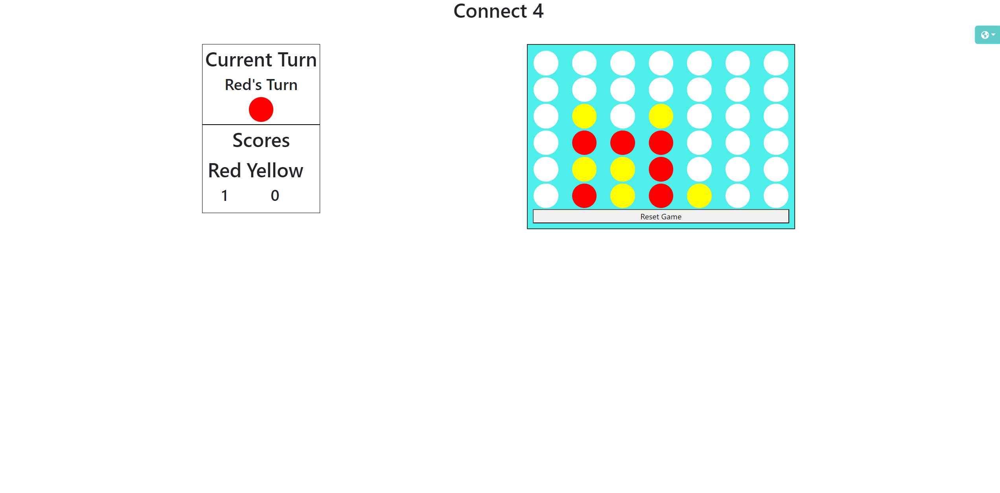
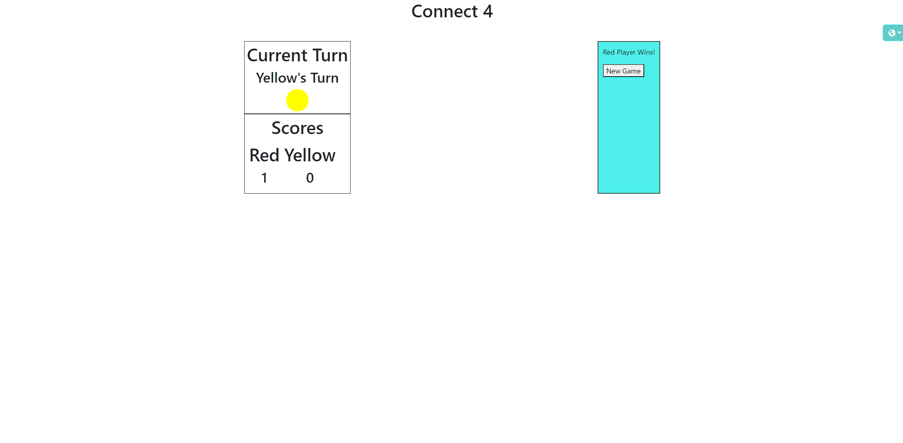

# - 🔴 - Connect 4 - 🟡 -

This is my game of a classic game of Connect 4. The game is against 2 people and the game will end when it 1 player achieves 4 in a row or column of their color. The first player will decide to be red or yellow, this will be their decision. 

## Demo

https://6505112c3e04040008cd90a9--connect4-cj484.netlify.app/

## Screenshots

## Badges

